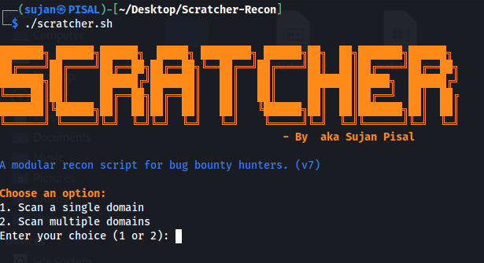

# Scratcher-Recon v7



A modular, color-coded bash script for automated reconnaissance during bug bounty hunting.

*Created by $ubzer0 aka Sujan Pisal*

## Features

* **Modular Scans:** Choose exactly what you want to run.
* **Multi-Target:** Scan a single domain or a list of multiple domains.
* **Dynamic Folders:** Creates a clean directory structure only for the scans you select.
* **Detailed Summary:** Finishes with a count of all results found.

## Scan Modules

1.  **Subdomain Enumeration:** (subfinder, findomain, subdominator, subzy, httpx)
2.  **URL Discovery:** (katana, gau, waybackurls)
3.  **GF Pattern Matching:** (xss, redirect, api-keys)
4.  **Nmap Port Scan:** (Top 1000 or all ports)

## 🛠️ Tools Required

This script is a wrapper and requires the following tools to be installed and in your system's `$PATH`:

* [subfinder](https://github.com/projectdiscovery/subfinder)
* [findomain](https://github.com/findomain/findomain)
* [subdominator](https://github.com/KY-S/subdominator)
* [subzy](https://github.com/LukaSikic/subzy)
* [httpx](https://github.com/projectdiscovery/httpx) (ProjectDiscovery version)
* [katana](https://github.com/projectdiscovery/katana)
* [gau](https://github.com/projectdiscovery/gau)
* [waybackurls](https://github.com/tomnomnom/waybackurls)
* [gf](https://github.com/tomnomnom/gf) (and Gf-Patterns)
* [nmap](https://nmap.org/)

## How to Use

1.  Clone this repository:
    ```bash
    git clone https://github.com/Subzer037/Scratcher-Recon.git
    ```
2.  Move into the directory:
    ```bash
    cd Scratcher-Recon
    ```
3.  Make the script executable:
    ```bash
    chmod +x scratcher.sh
    ```
4.  Run the script:
    ```bash
    ./scratcher.sh
    ```
